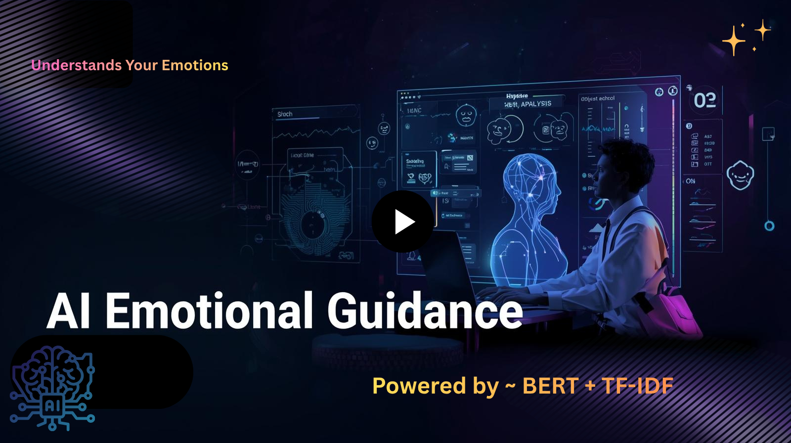
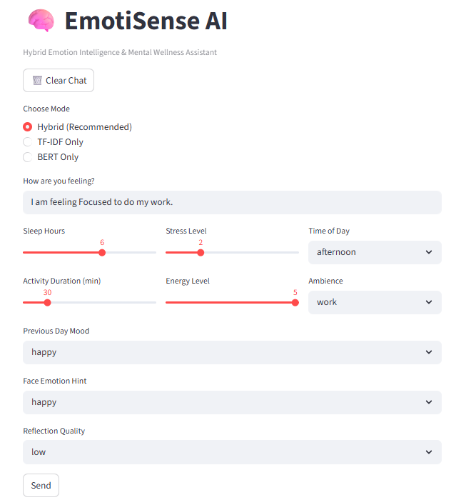
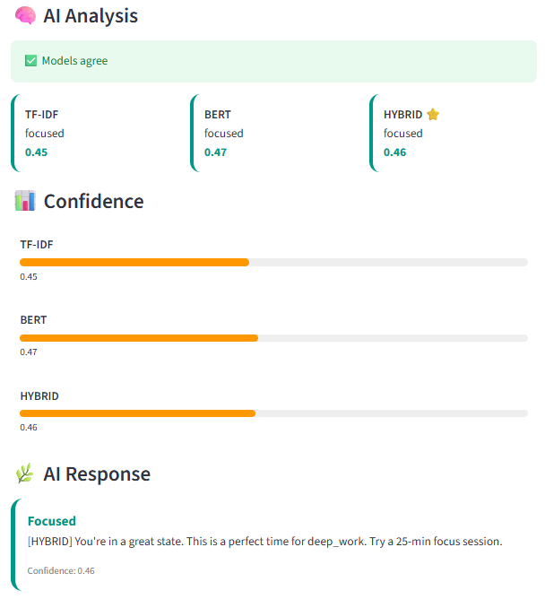
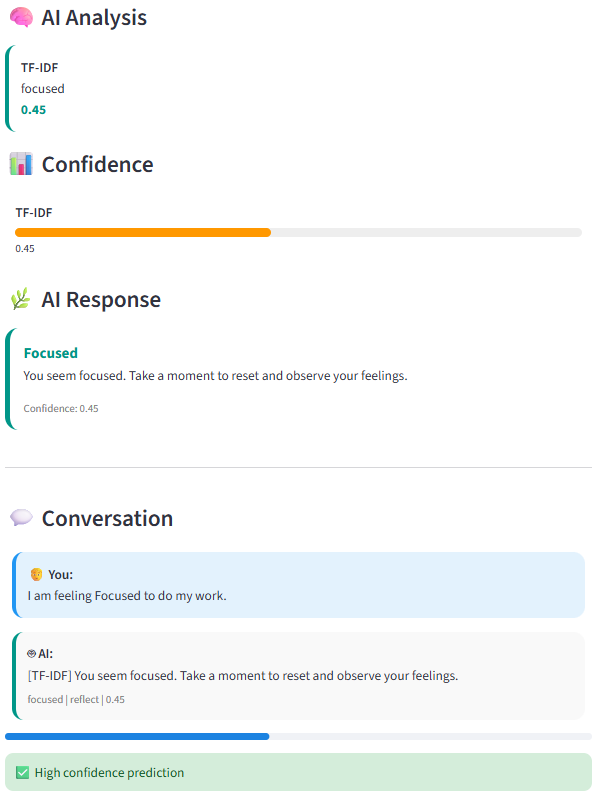
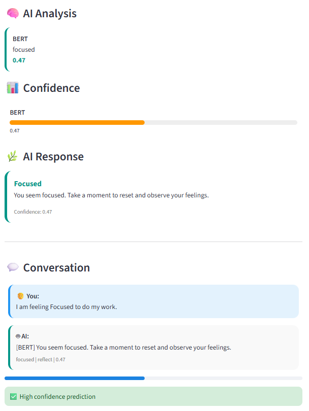
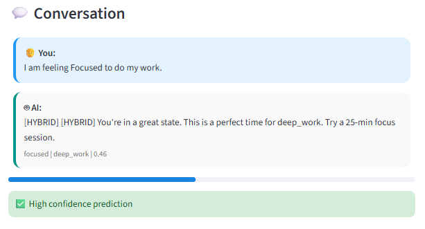
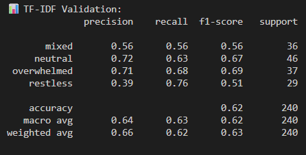
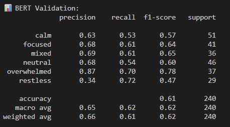

# 🧠 EmotiSense AI
<p align="center">
  
  
  
  
  
  
</p>

### Hybrid Emotion Intelligence & Mental Wellness Assistant

🚀 **EmotiSense AI** is a hybrid machine learning system that analyzes user emotions using text + behavioral signals and provides intelligent, actionable wellness recommendations.

It combines:

* 🔹 **TF-IDF + XGBoost** (pattern-based understanding)
* 🔹 **BERT embeddings + XGBoost** (semantic understanding)
* 🔹 **Hybrid Ensemble Model** (best of both worlds)

---

## 🌐 Live Demo

Click below to watch the full demo:

<p align="center">
  <a href="https://www.loom.com/share/279b6c42ce534a6fbf17090b89293598">
    
  </a>
</p>

---

# 🧠 How It Works

```text
User Input (Text + Context)
        ↓
Preprocessing (TF-IDF / BERT + Features)
        ↓
Parallel Models
   TF-IDF      BERT
        ↓        ↓
     Hybrid Ensemble
        ↓
Prediction + Confidence
        ↓
Decision Engine (Action)
        ↓
Interactive UI
```

---

# 📸 App Walkthrough

### 🧠 Input Parameters Interface

<p align="center">
  
</p>

📝 **Description:**  
The user provides both **text input ** and contextual features, such as stress level, sleep hours, mood history, and energy level.  
This enables **multi-dimensional emotion detection**, going beyond simple text-based models.

---

### ⚡ Hybrid Model Output (Final Decision)

<p align="center">
  
</p>

📝 **Description:**  
The hybrid model combines TF-IDF and BERT predictions using a **confidence-based ensemble strategy**.

✔ More stable predictions  
✔ Reduced overfitting  
✔ Improved real-world reliability  

---

## 🔍 TF-IDF Model Output

<p align="center">
  
</p>

📝 **Description:**  
TF-IDF captures **keyword-level patterns** and performs well on structured inputs.  
However, it may miss deeper semantic meaning in complex emotional expressions.

---

### 🧬 BERT Model Output

<p align="center">
  
</p>

📝 **Description:**  
BERT captures **contextual and semantic meaning** of user input.  
It handles nuanced emotions effectively but may yield **lower confidence scores** than TF-IDF.

---

## 💬 Conversation Interface
<p align="center">
  
</p>

A clean chat-style interface improves user interaction and usability.

✨ **Features:**

* Emotion-based color coding
* Confidence indicators
* Smooth conversational flow

---
## 📊 Model Performance & Evaluation

### 📈 Confusion Matrix – TF-IDF

<p align="center">
  
</p>

📝 **Insights:**
- High-confidence predictions  
- Slight bias toward dominant classes  
- Struggles with subtle emotional variations  

---

### 📈 Confusion Matrix – BERT

<p align="center">
  
</p>

📝 **Insights:**
- Better generalization across classes  
- Handles ambiguous inputs effectively  
- Lower confidence but more balanced predictions  

---

# ⚙️ Key Features

* 🧠 Hybrid emotion classification system
* 📊 Confidence-based predictions
* 🔍 Model comparison & explainability
* 🎯 Context-aware decision engine
* 🌿 Mental wellness recommendations
* 💬 Interactive chat UI

---
## 🧠 Why Hybrid Model?

Single models have inherent limitations:

- **TF-IDF** → lacks contextual understanding  
- **BERT** → computationally expensive, sometimes low confidence  

### ✅ Hybrid Approach:

- Combines the strengths of both models  
- Reduces individual weaknesses  
- Produces more **robust and reliable predictions**  
- Better suited for real-world emotional intelligence systems  

---
## 📂 Dataset

- Total Samples: 240 
- Features:
  - Text input  
  - Stress level  
  - Sleep hours  
  - Energy level  
  - Previous mood  
  - Time of day  

⚠️ *Note: Dataset is anonymized and used for research purposes.*

---


# 🧠 Tech Stack

| Category      | Tools                       |
| ------------- | --------------------------- |
| ML Models     | XGBoost, Scikit-learn       |
| NLP           | SentenceTransformers (BERT) |
| Frontend      | Streamlit                   |
| Backend       | Flask (optional)            |
| Data          | Pandas, NumPy               |
| Model Storage | Joblib                      |

---

# 📊 Model Design

| Model  | Role                           |
| ------ | ------------------------------ |
| TF-IDF | Captures keyword patterns      |
| BERT   | Captures semantic meaning      |
| Hybrid | Improves accuracy & robustness |

---

# 🔍 Error Analysis Insights

* BERT → accurate but low confidence
* TF-IDF → overconfident sometimes
* Hybrid → balanced & more reliable

📄 Detailed analysis: `docs/ERROR_ANALYSIS.md`

---

# 🚀 How to Run Locally

### 🔹 Clone Repository

```bash
git clone https://github.com/DHANASHRI1221/EmotiSense-AI.git
cd EmotiSense-AI
```

### 🔹 Install Dependencies

```bash
pip install -r requirements.txt
```

---

# ▶️ Run the App

### ✅ Recommended (Standalone)

```bash
streamlit run app_streamlit.py
```

### ⚙️ API + Frontend Mode

```bash
python api.py
streamlit run app.py
```

---

# 📁 Project Structure

```text
├── app.py
├── app_streamlit.py
├── api.py
├── src/
├── models/
├── outputs/
├── docs/
├── README.md
```

---

# 💡 Key Learnings

* Hybrid models outperform individual models
* Confidence calibration is critical in ML systems
* Combining text + context improves predictions
* Explainable UI improves user trust

---

# 🚀 Future Improvements

* 🔬 Fine-tuned transformer model
* 📊 Emotion trend tracking
* 🧠 Explainability (SHAP)
* 🎯 Personalized recommendations

---

# 👨‍💻 Author

**Dhanashri Shivdas**


---

# ⭐ Support

If you like this project, consider giving it a ⭐ on GitHub!
